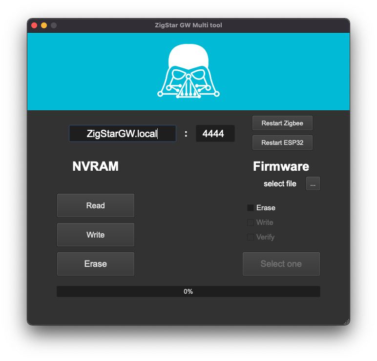
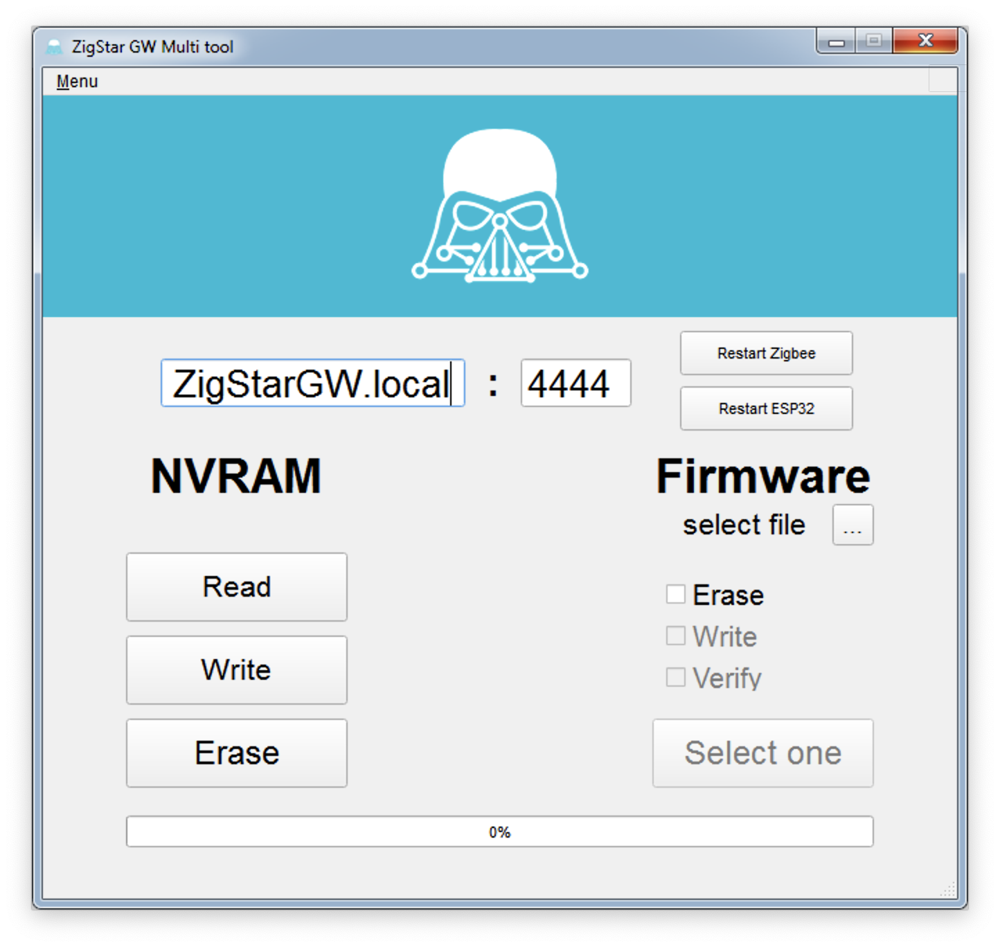

# ZigStar GW Multi tool
is GUI wrapper designed for convenient service work with Zig Star LAN GW and packed into single executable file.  
You can get started without installing Python and the required modules, and without using the terminal, - just download and open.

## Possibilities:
- Read / Write / Erase NVRAM memory of Zigbee module
- Write / Verify / Erase firmware of Zigbee module
- Backdoor Serial Loader turns on automatically
- Manual restart of  Zigbee module or ESP32 is available

### Based on
[zigpy/zigpy-znp](https://github.com/zigpy/zigpy-znp)  
[JelmerT/cc2538-bsl](https://github.com/JelmerT/cc2538-bsl)  

#### Screenshots
##### OS X

##### Windows

xyzroe/ZigStarGW-MT is licensed under the  
###### [GNU General Public License v3.0](https://github.com/xyzroe/ZigStarGW-MT/blob/main/LICENSE)
